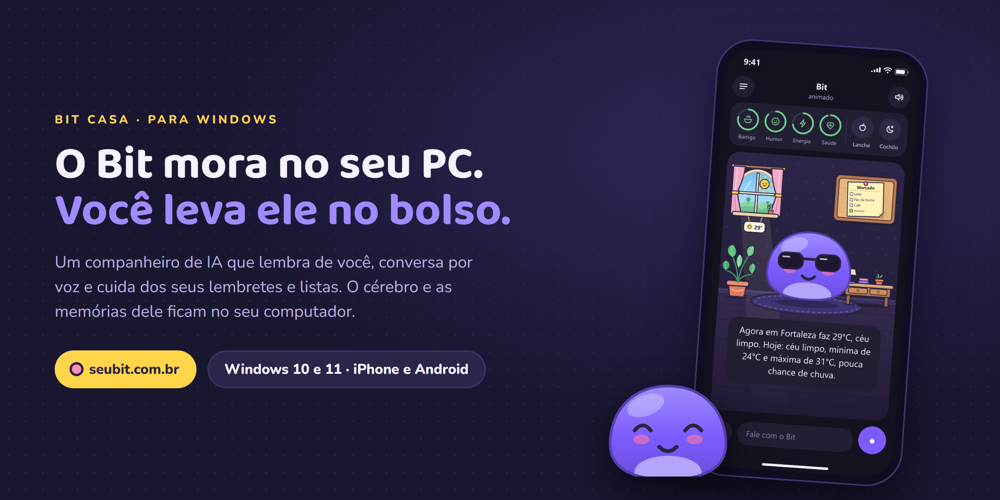
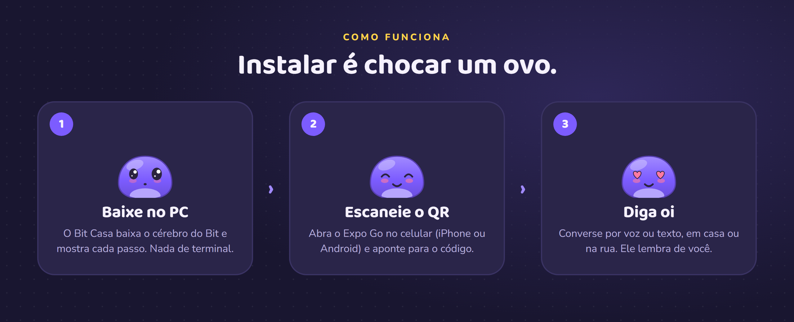
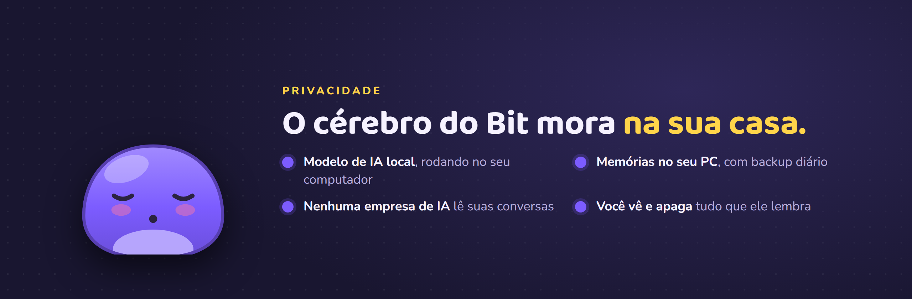

  

  
  &nbsp;
  
  &nbsp;
  

<h3 align="center">Um bichinho que mora no seu PC e conversa com você onde você estiver.</h3>

O Bit lembra do que você conta, fala por voz e cuida dos seus lembretes e das suas listas. 
A inteligência e as memórias dele ficam no seu computador. Nenhuma empresa de IA lê as suas conversas.

 

## Um amigo que também ajuda no dia a dia

É só falar ou escrever do seu jeito. O Bit entende e resolve.

| | |
|---|---|
| **Lembra de você** Guarda o que você conta, confirma quando tem dúvida e puxa o assunto depois. | **Tem vida própria** Sente fome e sono. Você dá um lanche, ele cochila e muda de humor. |
| **Conversa por voz** Fale com ele como num walkie-talkie. Ele ouve e responde em voz alta. | **Lembretes e timer** "Me lembra de pagar a luz toda segunda até o fim do mês." Pronto. |
| **Listas e anotações** "Coloca pão e café no mercado." "Anota o nome daquele filme." | **Tempo, cotação e pesquisa** Previsão da sua cidade, dólar, euro, bitcoin e respostas da internet. |
| **Jogos por voz** Quiz, adivinhar o número e verdade ou mentira, tudo falando. | **Cada Bit é único** Escolha corpo, rosto, orelhas e cor. Conquistas liberam acessórios novos. |

 

 

## Instalar

**No computador**

1. **[Baixe o Bit Casa](https://github.com/BrunoCotaXavier/bit-casa/releases/latest/download/BitCasa-Setup.exe)** e abra o instalador.
2. Crie sua conta (chega um código de 6 números no seu e-mail) e deixe o Bit Casa baixar o cérebro do Bit. Leva uns 15 minutos, quase tudo esperando o download.
3. Quando terminar, ele mostra um código QR.

**No celular**

1. Instale o **Expo Go** ([iPhone](https://apps.apple.com/app/expo-go/id982107779) ou [Android](https://play.google.com/store/apps/details?id=host.exp.exponent)).
2. Aponte a câmera para o QR do Bit Casa. Lendo isto no celular? Abra **[seubit.com.br/celular](https://seubit.com.br/celular)** e toque em **Abrir o Bit**.
3. Entre com a mesma conta e diga oi.

O passo a passo completo, com solução para os problemas mais comuns, está em **[seubit.com.br](https://seubit.com.br/#guia)**.

## O que você precisa

| | |
|---|---|
| **Sistema** | Windows 10 ou 11 (64 bits) |
| **Memória** | 8 GB de RAM |
| **Espaço** | 5 GB livres |
| **Placa de vídeo** | Opcional. Com 4 GB ou mais o Bit responde mais rápido |
| **Celular** | iPhone ou Android com o Expo Go |

O PC precisa estar ligado para o Bit responder. Com ele desligado, o app mostra que o Bit está dormindo. O Bit Casa fica na bandeja, liga junto com o Windows e se atualiza sozinho.

## Perguntas rápidas

<b>O Windows disse "o Windows protegeu o computador"</b>

 
O instalador ainda não tem assinatura digital. Clique em <b>Mais informações</b> e depois em <b>Executar assim mesmo</b>.

<b>Onde ficam as minhas memórias?</b>

 
No seu computador, em <code>%LOCALAPPDATA%\BitCasa</code>, com cópia de segurança diária dos últimos 7 dias. A nuvem guarda só a sua conta e faz a ponte entre o celular e o PC.

<b>Como desinstalar?</b>

 
Configurações &gt; Aplicativos &gt; Bit Casa &gt; Desinstalar. O desinstalador pergunta se apaga também o que foi baixado. Se você escolher apagar, as memórias guardadas neste PC vão junto.

 

  

Este repositório guarda só os instaladores do Bit Casa. Novidades em <a href="https://seubit.com.br">seubit.com.br</a>.

